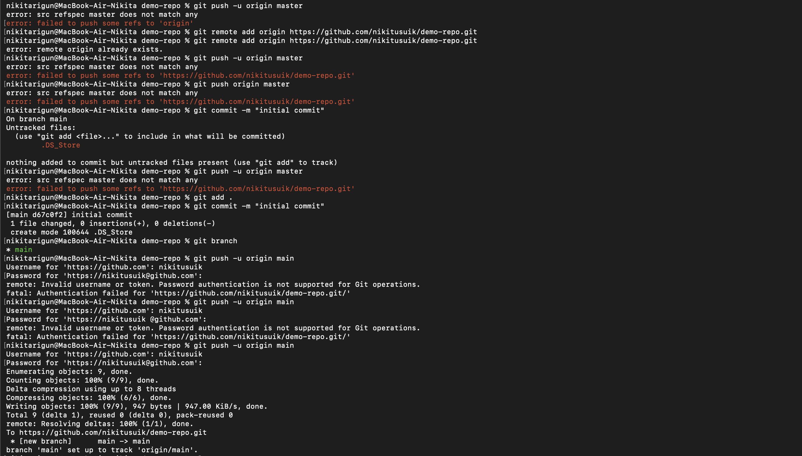
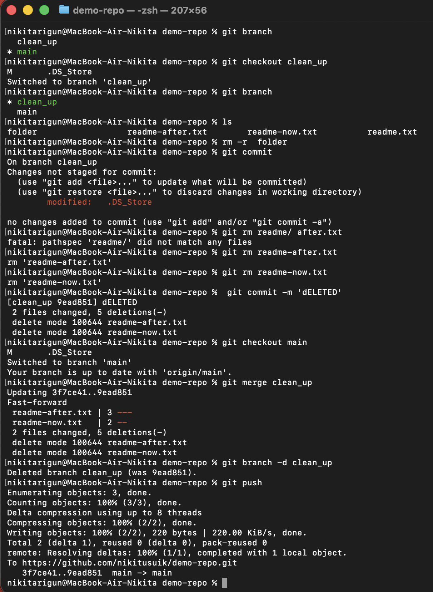
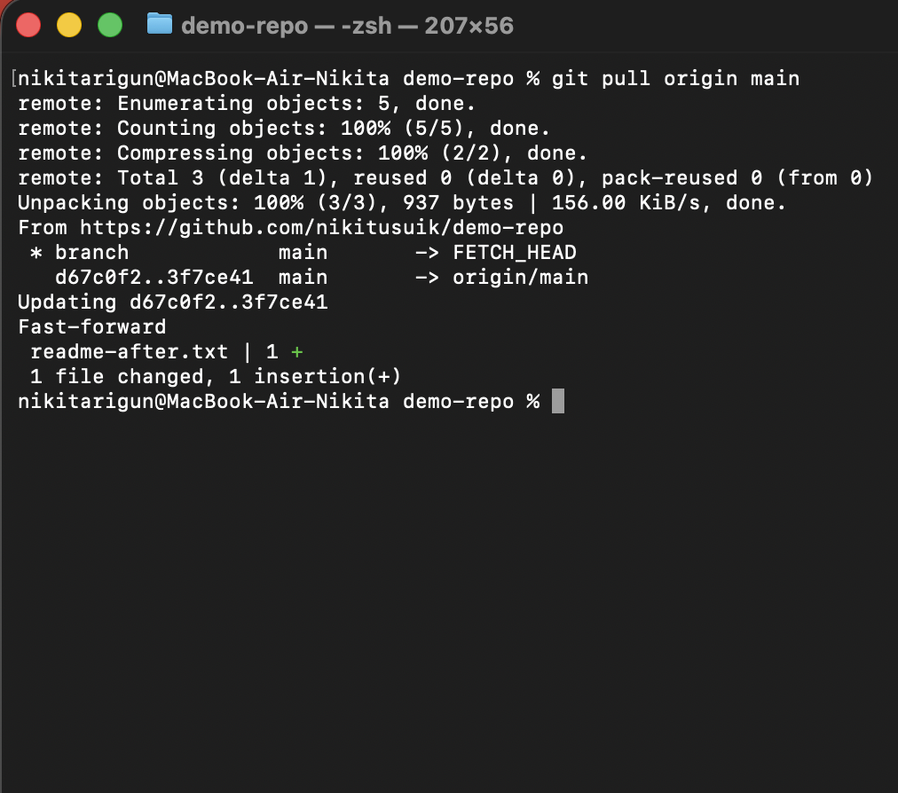

# Работа с Git и GitHub

В рамках данной работы я повторял действия преподавателя по шагам, изучая основы работы с системой контроля версий Git и удалённым репозиторием GitHub.  
В процессе возникали ошибки, которые были проанализированы и исправлены.

---

## 1. Инициализация репозитория и первый push



На начальном этапе я попытался отправить изменения в удалённый репозиторий с помощью команды:

```bash
git push -u origin master
````

### Возникшие проблемы

* Возникла ошибка:

  ```text
  src refspec master does not match any
  ```
* В репозитории отсутствовали коммиты
* Ветка `master` не существовала (используется ветка `main`)
* GitHub не принимал пароль при выполнении `git push`

### Выполненные действия

* Добавил файлы в индекс:

  ```bash
  git add .
  ```
* Создал первый коммит:

  ```bash
  git commit -m "initial commit"
  ```
* Выполнил отправку изменений в ветку `main`:

  ```bash
  git push -u origin main
  ```
* Для аутентификации использовал **Personal Access Token**

### Результат

* Первый коммит был успешно загружен в GitHub
* Локальная ветка `main` была связана с `origin/main`

---

## 2. Работа с ветками



Далее была выполнена работа в отдельной ветке.

### Действия

* Просмотр существующих веток:

  ```bash
  git branch
  ```
* Переход в ветку `clean_up`:

  ```bash
  git checkout clean_up
  ```

### Изменения

* Удалены файлы:

  ```bash
  git rm readme-after.txt
  git rm readme-now.txt
  ```
* Создан коммит с внесёнными изменениями:

  ```bash
  git commit -m "DELETED"
  ```

### Результат

* Изменения были зафиксированы в ветке `clean_up`

---

## 3. Слияние веток и удаление временной ветки

После завершения работы в отдельной ветке изменения были объединены с основной веткой.

### Действия

* Возврат в ветку `main`:

  ```bash
  git checkout main
  ```
* Слияние ветки `clean_up`:

  ```bash
  git merge clean_up
  ```
* Удаление временной ветки:

  ```bash
  git branch -d clean_up
  ```
* Отправка обновлений в удалённый репозиторий:

  ```bash
  git push
  ```

### Результат

* Слияние прошло в режиме **fast-forward**
* Ветка `main` была успешно обновлена на GitHub

---

## 4. Получение изменений из удалённого репозитория



На заключительном этапе были получены изменения из удалённого репозитория.

### Действие

```bash
git pull origin main
```

### Результат

* Локальный репозиторий был синхронизирован с GitHub
* Все изменения успешно применены

---

