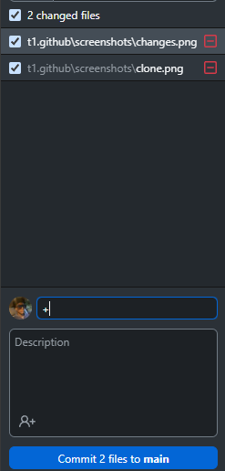
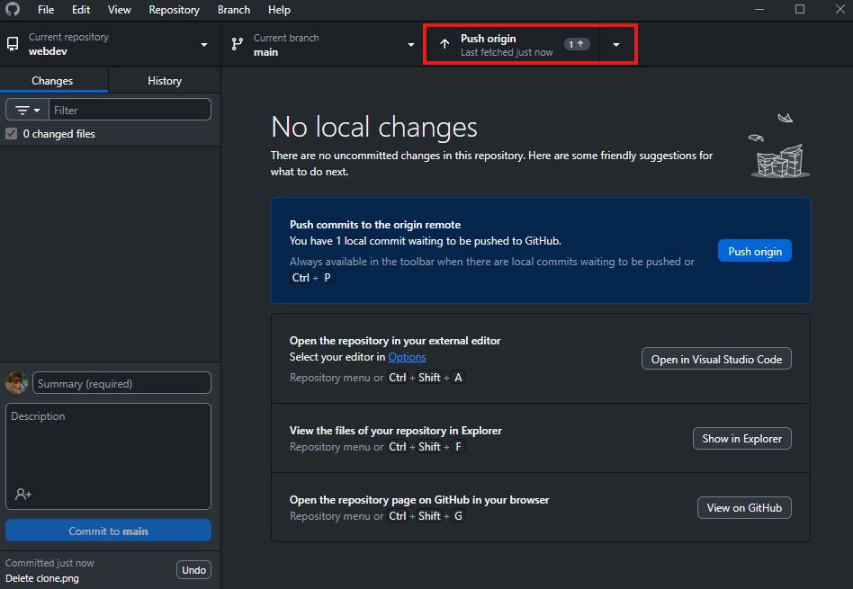
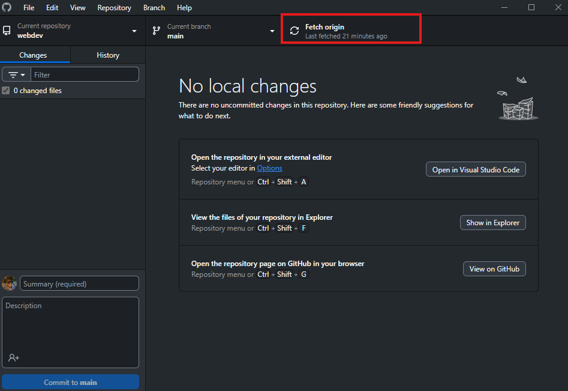
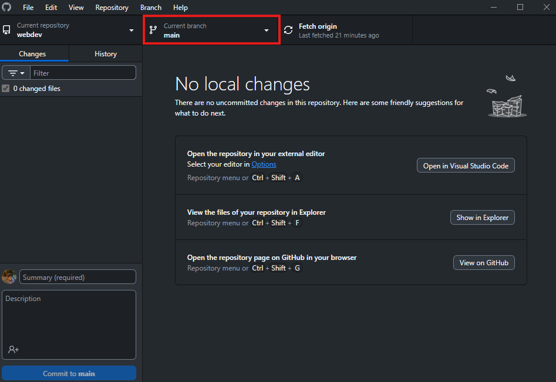

# Демонстрация команд Git в GitHub Desktop

Скриншоты сделаны на Windows (на macOS снимать было неудобно).

---

### 1. Клонирование репозитория (`git clone`)

**File → Clone repository** — выбирается репозиторий на GitHub и локальная папка.


---

### 2. Отслеживание изменений (`git status`)

GitHub Desktop показывает список изменённых файлов — аналог `git status`.


---

### 3. Добавление файлов в индекс (`git add`)

Отмеченные файлы попадают в staging area — аналог `git add`.

```bash
git add .
```



---

### 4. Создание коммита (`git commit`)

Сообщение коммита + кнопка **Commit to …**.

```bash
git commit -m "commit message"
```


---

### 5. Отправка изменений (`git push`)

Кнопка **Push origin**.

```bash
git push
```



---

### 6. Получение изменений (`git pull`)

**Fetch origin / Pull origin**.

```bash
git pull
```



---

### 7. Работа с ветками

Создание ветки, переключение, merge через интерфейс.

```bash
git branch
git checkout branch_name
git merge branch_name
```



---

## Особенности GitHub Desktop

**Плюсы:** удобный GUI, наглядный diff, не нужен постоянный терминал, удобно новичкам.

**Минусы:** ограниченные возможности для сложных сценариев (rebase, cherry-pick, автоматизация).
