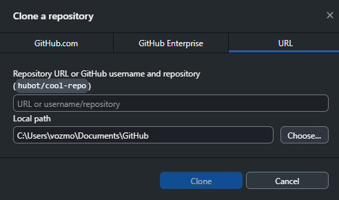
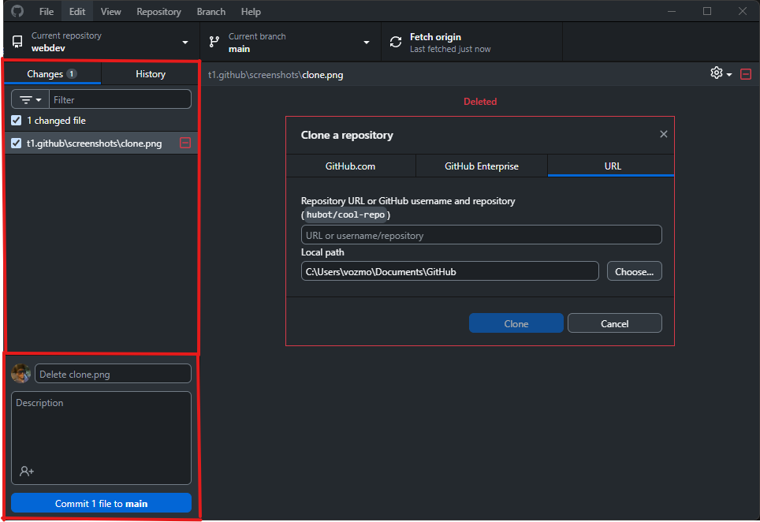
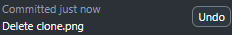

## Демонстрация выполнения команд Git в GitHub Desktop

*(Скриншоты сделаны на Windows — на macOS было неудобно снимать.)*

---

### 1. Клонирование репозитория (`git clone`)

Клонирование репозитория выполняется через меню GitHub Desktop:

**File → Clone repository**

Пользователь выбирает репозиторий на GitHub и указывает локальную папку для сохранения.

**Скриншот:**



---

### 2. Отслеживание изменений (`git status`)

После внесения изменений GitHub Desktop автоматически показывает список изменённых файлов и их состояние.

Это соответствует выполнению команды:

```bash
git status
````

**Скриншот:**



---

### 3. Добавление файлов в индекс (`git add`)

Все изменённые файлы отображаются в списке Changes. Пользователь может выбрать файлы (и в некоторых случаях отдельные строки), которые попадут в коммит.

Это соответствует команде:

```bash
git add .
```

**Скриншот:**

Отмеченные файлы, подготовленные к коммиту (staging area).


---

### 4. Создание коммита (`git commit`)

Для создания коммита вводится сообщение и нажимается кнопка **Commit to main** (или Commit to *название_ветки*).

Это соответствует команде:

```bash
git commit -m "commit message"
```

**Скриншот:**

Окно создания коммита с введённым сообщением.



---

### 5. Отправка изменений в удалённый репозиторий (`git push`)

После создания коммита изменения отправляются на GitHub с помощью кнопки **Push origin**.

Это соответствует команде:

```bash
git push
```

**Скриншот:**

Кнопка Push origin или сообщение об успешной отправке.


---

### 6. Получение изменений из удалённого репозитория (`git pull`)

Для получения обновлений используется кнопка **Fetch origin / Pull origin**.

Это соответствует команде:

```bash
git pull
```

**Скриншот:**

Процесс получения изменений или обновлённое состояние репозитория.


---

### 7. Работа с ветками (`git branch`, `git checkout`, `git merge`)

В GitHub Desktop можно:

* создать новую ветку
* переключаться между ветками
* выполнять слияние веток через интерфейс

Соответствующие команды Git:

```bash
git branch
git checkout branch_name
git merge branch_name
```

**Скриншот:**

Меню выбора веток и процесс слияния.


---

## Особенности GitHub Desktop

### Преимущества

* удобный графический интерфейс
* наглядный просмотр изменений (diff)
* не требует постоянной работы в терминале
* подходит для начинающих

### Ограничения

* ограниченные возможности для сложных операций Git
* не предназначен для автоматизации и сложных сценариев (rebase, cherry-pick и т.д.)

---

